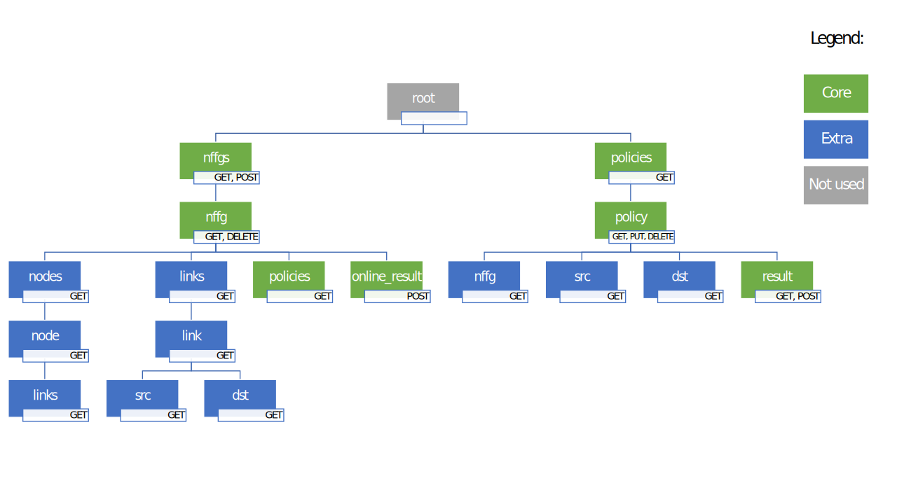

# Design of RESTful API for NFFG verifier

## 1. Conceptual structure of the resources

### Basic structure

The conceptual structure of the data to be represented in the service has a hierarchical structure that is:

- there is a collection of **NFFGs** (top level resource)
- the collection is a set of **NFFG** (child resource), that contain information about nodes and links
- each NFFG has a child resource that represents **policies**
- policies is a collection of **policy** resources
- each policy can have a **result** resource

```text
     nffgs
       |
      nffg
       |
    policies
       |
     policy
```

This basic schema has resources only for unit of data that need to be manipulated separately. This is not the complete structure that I designed. The complete structure, that is more complete and complex, will be explained in details and is needed in order to make the data available in an easier way for the clients.

### Complete structure



The service consists of two top level resources: one for NFFGs and the other one for policies.

#### Policies placement

The `policies` are made available as root elements because the clients may want to get the whole set of policies stored inside the server, without being specific on policies belonging to a single NFFG. Since the name of a policy is unique not only iniside a single NFFG, but has a global scope, it is appropriate that also the child resource `policy` belongs to this subtree.

The `policies` resource remains as child of nffg only for creation/update and for getting the collection of the policies of a specific nffg.

#### Policy creation and modification

Single policies can be created and updated using the same procedure: a PUT request on the `policy` resource child of `policies`. Because the requirements specify that if a new policy is submitted with the same name as an already stored one, a replacement will occurr, to update or to create a policy the client can use the same PUT request. The HTTP method chosen is PUT, because it is idempotent.

#### Ignored fields of POST requests

The POST requests done on resource whose ancestors are identified by a name, may contain a reference to the ancestor. Those fields will be ignored by the service.

For example, a POST request for creating a policy may contain the nffg name. This information, since is already provided by the path on which the POST request is done, is not required and will be ignored.

#### Other notes on the strucure TODO

## 2. Mapping of the resources to URLs

The tree structure of the resources previously shown is reflected on the URLs used. Curly braces are used in the following when the path contains an identifier.

| URL                     | resource type | method | usage
| ---                     | ------------- | ------ | --------
| `/nffgs`                | nffgs         | GET    | obtain the collection of NFFGs
|                         |               | POST   | store a new NFFG
| `/nffgs/{nffg_name}`    | nffg          | GET    | obtain a single NFFG given its name
|                         |               | DELETE | delete a single NFFG given its name
| `/nffgs/{nffg_name}/policies`  | policy | GET    | obtain the collection of policies belonging to a NFFG whose name is given
| `/nffgs/{nffg_name}/online_result` | result |POST| obtain the result of a policy provided in the request testing it against an existing NFFG given its name
| `/policies`              | policies     | GET    | obtain the collection of all the policies
| `/policies/{policy_name}`| policy       | GET    | obtain a single policy given its name
|                          |              | PUT   | store a policy on this resource (both creation or update)
|                          |              | DELETE | delete a single policy given its name
| `/policies/{policy_name}/result` | result | GET   | obtain (if any) the stored result for the stored policy given its name
|                          |              | POST   | recompute and obtain the result of a stored policy

Additional resources can be used to obtain partial information about the data.

| URL                                         | resource type | method | usage
| ---                                         | ------------- | ------ | --------
| `nffgs/{nffg_name}/nodes`                   | nodes         | GET    | obtain the collection of nodes belonging to a stored nffg
| `nffgs/{nffg_name}/nodes/{node_name}`       | nodes         | GET    | obtain a single node belonging to a stored nffg
| `nffgs/{nffg_name}/nodes/{node_name}/links` | links         | GET    | obtain the collection of links outgoing from a  node belonging to a stored nffg
| `nffgs/{nffg_name}/links`                   | links         | GET    | obtain the collection of links belonging to a stored nffg (outgoing from all the nodes belonging to the nffg)
| `nffgs/{nffg_name}/links/{link_name}`       | links         | GET    | obtain a single link belonging to a stored nffg given its name
| `nffgs/{nffg_name}/links/{link_name}/src`   | node          | GET    | obtain the source node of a link belonging to a stored nffg
| `nffgs/{nffg_name}/links/{link_name}/dst`   | node          | GET    | obtain the destination node of a link belonging to a stored nffg
| `policies/{policy_name}/nffg`               | nffg          | GET    | obtain the NFFG that the policy belongs to
| `policies/{policy_name}/src`                | node          | GET    | obtain the source node of the reachability policy
| `policies/{policy_name}/dst`                | node          | GET    | obtain the destination node of the reachability policy

## 3. Operations by resource

### `/nffgs`

NFFGs collection

| method | request type | response type | explaination           | errors
| ------ | ------------ | ------------- | ------------           | ------
| GET    | -            | nffgs         | get the collection of NFFGs (pagination) |
| POST   | nffg_req     | nffg          | create a new NFFG      | 4xx wrong request, 403 already existing

TODO: the id of nffg (named entities) is the name? PROs: same type in POST request and in response, no duplicated unique attribute, no need to store name mappings to ids. CONs: the name is always a valid URL?

### `/nffgs/{nffg_id}`

A single nffg identified by its id

| method | request type | response type | explaination           | errors
| ------ | ------------ | ------------- | ------------           | ------
| GET    | -            | nffg          | get the NFFG           | 404: wrong nffg_id
| DELETE | -            | OK            | delete the NFFG        | 404: wrong nffg_id

### `/nffgs/{nffg_id}/nodes`

Nodes collection for this NFFG

| method | request type | response type | explaination           | errors
| ------ | ------------ | ------------- | ------------           | ------
| GET    | -            | nodes         | get the nodes          | 404: wrong nffg_id

### `/nffgs/{nffg_id}/nodes/{node_id}`

A node identified by its id

| method | request type | response type | explaination           | errors
| ------ | ------------ | ------------- | ------------           | ------
| GET    | -            | node          | get the node           | 404: wrong nffg_id/node_id

### `/nffgs/{nffg_id}/links`

Links collection for this NFFG

| method | request type | response type | explaination           | errors
| ------ | ------------ | ------------- | ------------           | ------
| GET    | -            | links         | get the links          | 404: wrong nffg_id

### `/nffgs/{nffg_id}/links/{link_id}`

A link identified by its id

| method | request type | response type | explaination           | errors
| ------ | ------------ | ------------- | ------------           | ------
| GET    | -            | link          | get the link           | 404: wrong nffg_id/link_id

### `/nffgs/{nffg_id}/policies`

Policies collection for this NFFG

| method | request type | response type | explaination           | errors
| ------ | ------------ | ------------- | ------------           | ------
| GET    | -            | policies      | get the collection of policies (pagination)  | 404: wrong nffg_id
| POST   | policy_req   | policy        | create a new policy    | 404: wrong nffg_id, 4xx: wrong request; always replace

### `/nffgs/{nffg_id}/policies/{policy_id}`

A policy identified by its id

| method | request type | response type | explaination           | errors
| ------ | ------------ | ------------- | ------------           | ------
| GET    | -            | policy        | get the policy         | 404: wrong id
| DELETE | -            | OK            | delete the policy      | 404: wrong id

### `/nffgs/{nffg_id}/policies/{policy_id}/result`

The result of this policy

| method | request type | response type | explaination           | errors
| ------ | ------------ | ------------- | ------------           | ------
| GET    | -            | result        | the verification of policy is performed and the result is both stored and returned | 404: wrong id

### `/nffgs/{nffg_id}/online_result`

Verification endpoint for client policies, not stored on the service

| method | request type | response type | explaination           | errors
| ------ | ------------ | ------------- | ------------           | ------
| POST   | policy_req   | policy/result?? | get the result for this policy | 404: wrong id, 4xx: wrong request

### `/policies`

This is a flat view on the policies. But should be readonly: POST requests should also contain the NFFG name/id and another type should be created.

There is a queryParam named `from` that can be used to get policies only from a certain time.

??? TODO: replication of subtree about policies

### `/policies/{policy_id}`

A single policy identified by its id.

### `/policies/{policy_id}/nffg`

The nffg this policy belongs to

### `/policies/{policy_id}/src`

The src node if this is a reachability policy (always)

### `/policies/{policy_id}/dst`

The dst node if this is a reachability policy (always)

### `/policies/{policy_id}/result`

The corresponding result for this policy
