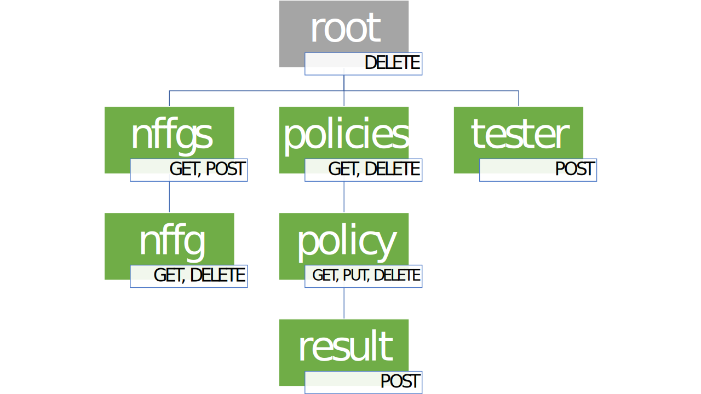

# Design of RESTful API for NFFG verifier

## 1. Conceptual structure of the resources

### Basic structure

The conceptual structure of the data to be represented in the service has a hierarchical structure that is:

- there is a collection of **NFFGs** (top level resource)
- the collection is a set of **NFFG** (child resource), that contain information about nodes and links
- each NFFG has a child resource that represents **policies**
- policies is a collection of **policy** resources
- each policy can have a **result** resource

```text
     nffgs
       |
      nffg
       |
    policies
       |
     policy
       |
     result
```

This basic schema has resources only for unit of data that need to be manipulated separately. This is not the actual structure that I designed. The complete structure, that has some more resources and moves the `policies` resource as a top level one, will be explained in details and is needed in order to make the data available in an easier way for the clients.

### Complete structure



The service consists of two top level resources: one for NFFGs and the other one for policies.

#### Policies placement

The `policies` are made available as root elements because the clients may want to get the whole set of policies stored inside the server. Since the name of a policy is unique not only iniside a single NFFG, but has a global scope, it is appropriate that also the child resource `policy` belongs to this subtree.

Therefore the `policies` resource has no more purpose of existing.

#### Policy creation and modification

Single policies can be created and updated using the same procedure: a PUT request on the `policy` resource child of `policies`. Because the requirements specify that if a new policy is submitted with the same name as an already stored one, a replacement will occurr, to update or to create a policy the client can use the same PUT request. The HTTP method chosen is PUT, because it is idempotent.

#### Other notes on the strucure TODO

## 2. Mapping of the resources to URLs

The tree structure of the resources previously shown is reflected on the URLs used. Curly braces are used in the following when the path contains an identifier.

| URL                     | resource type | method | usage
| ---                     | ------------- | ------ | --------
| `/nffgs`                | nffgs         | GET    | obtain the collection of NFFGs
|                         |               | POST   | store a new NFFG
| `/nffgs/{nffg_name}`    | nffg          | GET    | obtain a single NFFG given its name
|                         |               | DELETE | delete a single NFFG given its name
| `/nffgs/{nffg_name}/policies`  | policy | GET    | obtain the collection of policies belonging to a NFFG whose name is given
| `/nffgs/{nffg_name}/online_result` | result |POST| obtain the result of a policy provided in the request testing it against an existing NFFG given its name
| `/policies`              | policies     | GET    | obtain the collection of all the policies
| `/policies/{policy_name}`| policy       | GET    | obtain a single policy given its name
|                          |              | PUT   | store a policy on this resource (both creation or update)
|                          |              | DELETE | delete a single policy given its name
| `/policies/{policy_name}/result` | result | GET   | obtain (if any) the stored result for the stored policy given its name
|                          |              | POST   | recompute and obtain the result of a stored policy

### IDs

Since both the NFFGs and the policies are identified by their name (as specified in the requirements of assignment 1) and since their pattern is quite strict (only alphabetical characters), the names can be used directy as path elements and therefore the ID of the resources is chosen by the client.

For the NFFGs creation, the POST method is used because the creation is not idempotent as explained in the requirements (creation of an NFFG with the same name as an existing one is forbidden). Instead for the policies, since the creation of a policy with the same name as one already stored in the service is allowed and is used for replacement, the creation of a policy uses the same method as the replacement/update. In this way the client directly submits a PUT request to the path that contains the name of the policy, and since PUT is idempotent the creation follows the same approach as an update.

## 3. Operations by resource

All the operations are available with Content-Type (both requests and responses) `application/xml` or `application/json`. The types used are the ones contained in the XSD.

Errors on all the resources: 406 500 400 

### `/nffgs`

NFFGs collection

| method | request type | response type | explaination                | result      | errors
| ------ | ------------ | ------------- | ------------                | ----------- | ------
| GET    | -            | nffgs         | get the collection of NFFGs | 200 OK      | -
| POST   | nffg         | nffg          | create a new NFFG           | 201 CREATED | 422 validation error, 409 already existing

The POST request must contain the field `name`, that will be the identifier of the created resource if the request succeeds. In case the name is already used by another stored NFFG, the service returns a HTTP 403 error. Instead if the request itself contains an error when doing validation of the data contained, the service returns a HTTP 422 error.

### `/nffgs/{nffg_name}`

A single nffg identified by its name.

| method | request type | response type | explaination           | result | errors
| ------ | ------------ | ------------- | ------------           | ------ | ------
| GET    | -            | nffg          | get the NFFG           | 200 OK | 404: no NFFG exists with this name
| DELETE | -            | nffg          | delete the NFFG        | 200 OK | 404: no NFFG exists with this name

The DELETE has an optional queryParam that is required in the case that some policies are attached to this NFFG. The queryParam is `force` and the behaviour of the service is the following:

| DELETE                | with queryParam | without queryParam
| --------------------- | --------------- | --------------
| NFFG without policies | success         | success
| NFFG with policies    | success         | FAIL

### `/policies`

Policies collection

| method | request type | response type | explaination                   | result | errors
| ------ | ------------ | ------------- | ------------                   | ------ | ------
| GET    | -            | policies      | get the collection of policies | 200 OK |

queryParam:

- `nffg`: only get policies for a specific NFFG
- `from`: get policies only from a certain time

### `/policies/{policy_name}`

A single policy identified by its id.

| method | request type | response type | explaination             | result              | errors
| ------ | ------------ | ------------- | ------------             | ------              | ------
| GET    | -            | policy        | get the policy           | 200 OK              | 404: no policy exists with this name
| DELETE | -            | -             | delete the policy        | 200 OK              | 404: no policy exists with this name
| PUT    | policy       | policy        | update/create the policy | 200 OK, 201 CREATED | 422: validation error or invalid reference to stored resources

### `/policies/{policy_name}/result`

The corresponding result for this policy.

| method | request type | response type | explaination             | result | errors
| ------ | ------------ | ------------- | ------------             | ------ | ------
| POST   | -            | policy        | update the policy result | 200 OK | 404: no policy exists with this name

### `/verifier`

Verification endpoint for client policies, not stored on the service

| method | request type | response type | explaination           | result | errors
| ------ | ------------ | ------------- | ------------           | ------ | ------
| POST   | policy       | policy        | verify this policy     | 200 OK | 422: validation error or invalid reference to stored resources (nffg or node)

## 4. Implementation details

### Concurrency management

The synchronization without considering the removal of NFFGs is simply obtained by using ConcurrentMap.

- All the getters perform atomic operations on a single map (nffgs or policies). Then some filters can be applied on the set of values, but this operation is performed after the read of the data, so it is not a problem
- `storeNffg` performs a single atomic operation on the nffgs map: a `putIfAbsent` that is checking the existence and storing the new nffg in atomic way
- `storePolicy` is checking the references to nffg and nodes (src and dst) then is putting the new policy into the policies map. But since an NFFG cannot be deleted, after the check the references cannot be invalidated in any ways, so also in this case there is no need of additional synchronization
- `deletePolicy` is removing the policy from the map of policies in a single atomic operation
- `updatePolicyResult` is first getting the policy from its name then is verifying its result. Also if this is not a single operation and a deletion can occur in between, this is not a problem because in this case the serialized view of the events would be that the deletion occurred after the update of the result, without side effects because the update of the result does not operate on the map but only on an object that is stored inside it, and can be safely removed from the map preventing other threads to reach this policy that still exist for the thread that is handling the update
- `verifyResultOnTheFly` is first validating the references contained in the policy (nffg, src, dst) and then verifying the result. Since the referenced nffg cannot be deleted (or updated) the data are still valid also if these operations are not performed atomically

Considering also the deletion, the modifications done are the following:
- a RWLock is added for operations that modify the policies in order to make the assumptions above explained to be still valid:
  - the exclusive lock is used by the `deleteNffg` method. In this way, when this lock is acquired no other threads can operate on the policies (modification)
  - the shared lock is used by methods that modify the policies map
  - the getters need no synchronization if the modification keep the state always valid during the execution of single operations

In details the usage of locks by each method:
- `deleteNffg` in the critical section protected by exclusive lock is:
  - checking if some policies are linked and in this case can block the execution if the request does not force the removal
  - removing all the policies linked to this nffg from the policies map
  - removing the nffg from the nffgs map
- `storePolicy` uses a shared lock to validate the references and then storing in the policies map the new one. In this way the removal cannot occur between the two operations, and therefore the references are still valid
- `deletePolcy` uses a shared lock because the iteration that is occurring in the `deleteNffg` over the collection of policies acts on the valueSet that is not explicitly concurrent-safe also if it coming from a ConcurrentMap. In order to avoid any problems, the deletion of a single policy is done in a protected block
- `updatePolicyResult` uses the shared lock because after getting the policy from the name the verification is accessing the related nffg in order to use the ids, that must not be deleted between the two operations
- `verifyResultOnTheFly` uses the shared lock because after checking the references, the nffg must continue to be stored inside the nffgs map
- `storeNffg` does not need any locks because acts on completely new data. If the nffg stored with the same name is still being removed but not yet from the map, the serialized view of events will have the store before the deletion, without causing side effects.
- the getters don't require any lock because they read the data from a single map in atomic way. They also don't modify the data so they don't produce side effects.
- `getPolicies` is the only critical getter, that could give back a partial set of policies because the method `removeIf` called on the entrySet by the `deleteNffg` could be iterating and having removed only some policies belonging to the nffg that is being deleted. To avoid this problem, this method also uses the shared lock
